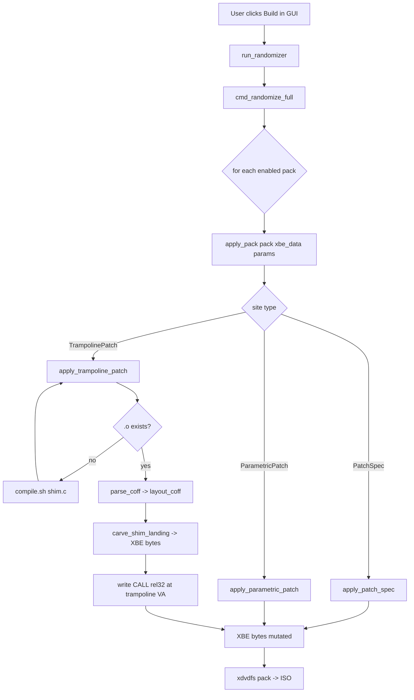

# Onboarding — zero to a landed feature

New contributor or AI agent walking into this repo for the first
time?  Start here.  Everything else in `docs/` is reference material
you'll reach for as you need it.

## 1. Five-minute tour

**What this repo does:** ships a tool (CLI + Tk GUI) that patches
the Xbox game **Azurik: Rise of Perathia** — randomizer, 60 FPS
unlock, quality-of-life tweaks, optional C-shim code injection.
Users drop a vanilla ISO in, click Build, and get a modded ISO out.

**How mods are organized:** one folder per feature under
[`azurik_mod/patches/`](../azurik_mod/patches/).  Today there are six:

```
azurik_mod/patches/
  fps_unlock/           (50 sites, experimental)
  player_physics/       (gravity + walk + run sliders)
  qol_gem_popups/       (hide 5 first-pickup popups)
  qol_other_popups/     (hide 9 tutorial / key / powerup popups)
  qol_pickup_anims/     (skip celebration animation)
  qol_skip_logo/        (skip boot logo — C shim)
```

Each folder holds:

```
azurik_mod/patches/<name>/
  __init__.py      ← the Feature(...) declaration (Python)
  shim.c           ← (only for C-shim features) the C source
  README.md        ← (optional) per-feature notes
```

**Three kinds of patch**, all declared the same way (as `sites=[...]`
on a `Feature`), dispatched uniformly by `apply_pack(pack, xbe,
params)`:

| Kind                 | For                                           |
|----------------------|-----------------------------------------------|
| `PatchSpec`          | fixed byte swap at a VA                        |
| `ParametricPatch`    | slider-driven float rewrite (GUI shows a slider) |
| `TrampolinePatch`    | CALL-into-C-shim code injection               |

**Tests:** comprehensive pytest suite under [`tests/`](../tests/), covering
every pack and the layout pipeline.  Always keep them green.

**Ghidra:** the XBE and keyed-table `.xbr` files are usually already
open in Ghidra (ports 8193+).  Reverse-engineering happens there.

## 2. Prerequisites

| You need          | To...                                              |
|-------------------|----------------------------------------------------|
| Python 3.10+      | Run everything (CLI, GUI, tests).                  |
| `xdvdfs`          | Pack / unpack Xbox ISOs.  Auto-downloaded on first use. |
| Clang (i386)      | Compile shim C code.  **Only shim authors need it.** |
| xemu              | Test the final patched ISO.                        |
| Ghidra            | Reverse-engineer new patch sites.                  |

End users applying pre-built patches don't need clang — `.o` files
can be committed, and every shim-backed feature has a legacy
byte-patch fallback triggered by `AZURIK_NO_SHIMS=1`.

Install deps:

```bash
python -m pip install -e .
python -m pytest tests/ -q   # all tests should pass
```

## 3. Worked example A — a tiny byte patch

Let's add a hypothetical `qol_skip_intro_music` feature.  You've
already found the music-start CALL in Ghidra at VA `0x00123450`
(bytes `E8 11 22 33 44`).

### Step 1: scaffold

```bash
bash shims/toolchain/new_shim.sh qol_skip_intro_music
```

This creates `azurik_mod/patches/qol_skip_intro_music/` with an
`__init__.py` + `shim.c`.  For a byte-only feature you can delete
`shim.c` — we're not writing C here.

### Step 2: rewrite `__init__.py` as a pure-byte feature

Replace the scaffold content with:

```python
"""qol_skip_intro_music — NOP out the intro music CALL at boot."""
from azurik_mod.patching import PatchSpec
from azurik_mod.patching.registry import Feature, register_feature

SKIP_MUSIC_SPEC = PatchSpec(
    label="Skip boot music",
    va=0x00123450,
    original=bytes.fromhex("E8 11 22 33 44"),
    patch=bytes([0x90] * 5),       # NOP x5
)

FEATURE = register_feature(Feature(
    name="qol_skip_intro_music",
    description="Skips the boot music intro.",
    sites=[SKIP_MUSIC_SPEC],
    apply=lambda xbe: None,         # generic dispatcher handles it
    category="qol",                 # GUI tab this pack lives in
    tags=(),                        # optional secondary badges
))

__all__ = ["FEATURE", "SKIP_MUSIC_SPEC"]
```

### Step 3: write a test

Create `tests/test_qol_skip_intro_music.py`:

```python
from azurik_mod.patches.qol_skip_intro_music import SKIP_MUSIC_SPEC

def test_spec_pins_va_and_bytes():
    assert SKIP_MUSIC_SPEC.va == 0x00123450
    assert SKIP_MUSIC_SPEC.original == bytes.fromhex("E8 11 22 33 44")
    assert SKIP_MUSIC_SPEC.patch == bytes([0x90] * 5)
```

### Step 4: run the tests

```bash
python -m pytest tests/ -q
```

The GUI's Patches page now has a new checkbox for your feature,
automatically.  The CLI's `verify-patches --strict` covers the new
site.  You didn't touch anything outside your feature folder.

## 4. Worked example B — a shim-backed feature

Same idea, but with logic that needs C.  Let's add
`qol_instant_menu` that hooks a 5-byte CALL at VA `0x00045678`
and replaces the menu-fade routine.

### Step 1: scaffold (keeps `shim.c` this time)

```bash
bash shims/toolchain/new_shim.sh qol_instant_menu
```

### Step 2: write your C body

Edit `azurik_mod/patches/qol_instant_menu/shim.c`:

```c
#include "azurik.h"

/* Vanilla call: menu_fade_in(duration_ms).  __stdcall, 4 bytes.
 * We skip the fade by returning immediately with alpha = 1.0. */
__attribute__((naked, stdcall))
void c_instant_menu(void) {
    __asm__ volatile (
        "mov  $0x3F800000, %%eax    \n\t"   /* 1.0f */
        "ret  $4                     \n\t"
        :
        :
        : "memory"
    );
}
```

### Step 3: fill in the trampoline VA

Edit `azurik_mod/patches/qol_instant_menu/__init__.py`:

```python
QOL_INSTANT_MENU_TRAMPOLINE = TrampolinePatch(
    name="qol_instant_menu",
    label="Instant menu transitions",
    va=0x00045678,
    replaced_bytes=bytes.fromhex("E8 AA BB CC DD"),   # the CALL bytes
    shim_object=_SHIM.object_path("qol_instant_menu", _REPO_ROOT),
    shim_symbol="_c_instant_menu@0",
    mode="call",
)
```

### Step 4: run the tests

```bash
python -m pytest tests/ -q
```

Auto-compile fires: `apply_pack` sees the missing
`shims/build/qol_instant_menu.o`, spots the sibling `shim.c`, and
runs `compile.sh` before applying.

### Step 5: boot in xemu

Unit tests prove the bytes are right; only xemu proves the behaviour
is right.  Always do a final boot-check for shim-backed features.

## 5. How the pieces fit



Key files behind each step:

| Step                        | File                                                |
|-----------------------------|-----------------------------------------------------|
| Pack discovery              | `azurik_mod/patching/registry.py`                   |
| Dispatcher                  | `azurik_mod/patching/apply.py::apply_pack`          |
| PatchSpec landing           | `azurik_mod/patching/apply.py::apply_patch_spec`    |
| Shim compile                | `shims/toolchain/compile.sh`                        |
| COFF parsing + layout       | `azurik_mod/patching/coff.py::layout_coff`          |
| XBE section surgery         | `azurik_mod/patching/xbe.py`                        |
| Kernel import stubs (D1)    | `azurik_mod/patching/shim_session.py`               |

## 5a. Reverse-engineering toolkit

Three CLI verbs accelerate the common RE workflows — skip the
bespoke Python one-liners and use these instead.

### `azurik-mod xbe` — work at the XBE byte/VA level

```bash
# VA ↔ file-offset (auto-detected by magnitude)
azurik-mod xbe addr 0x85700 --xbe default.xbe

# "Who pushes this VA as imm32?" — the single most useful RE verb
azurik-mod xbe find-refs --string fx_magic_timer --xbe default.xbe

# Find a float constant anywhere in .rdata
azurik-mod xbe find-floats 9.7 9.9 --xbe default.xbe --width float

# Byte context around a VA
azurik-mod xbe hexdump 0x19C1AC --length 64 --xbe default.xbe

# Strings with regex support
azurik-mod xbe strings 'levels/water/' --xbe default.xbe

# Section table dump
azurik-mod xbe sections --xbe default.xbe
```

Every verb accepts `--iso PATH.iso` instead of `--xbe` (auto-
extracts via `xdvdfs`) and `--json` for machine-readable output.
Full reference: [`docs/TOOLING_ROADMAP.md`](TOOLING_ROADMAP.md).

### `azurik-mod ghidra-coverage` — knowledge gap report

Cross-references our Python-side knowledge (`azurik.h` VA
anchors + `vanilla_symbols.py` entries + every registered patch
site) against an optional Ghidra snapshot:

```bash
azurik-mod ghidra-coverage                # offline inventory
azurik-mod ghidra-coverage --snapshot ghidra.json  # diff mode
```

Lists VAs we document but Ghidra still shows `FUN_*` for — your
next Ghidra knowledge-sync pass starts with that list.

### `azurik-mod shim-inspect` — preview what bytes a `.o` emits

```bash
# Inspect by feature folder (resolves to shims/build/<name>.o)
azurik-mod shim-inspect azurik_mod/patches/qol_skip_logo

# Or pass the .o directly
azurik-mod shim-inspect shims/build/qol_skip_logo.o
```

Reports section sizes, every symbol (global / external /
internal), and every relocation with its target.  Catches
`_Static_assert` failures, wrong REL32 targets, and "is my
trampoline <= 5 bytes?" questions without a full build cycle.

## 6. Where do I look when...

| Symptom                                           | Start reading                            |
|---------------------------------------------------|------------------------------------------|
| "Byte patch isn't landing — VA seems right"       | [SHIM_AUTHORING.md §4](SHIM_AUTHORING.md#4-common-pitfalls) (replaced_bytes mismatch) |
| "Shim compiles but crashes the game"              | [SHIM_AUTHORING.md §5](SHIM_AUTHORING.md#5-debugging-a-broken-shim) (debug playbook) |
| "My slider doesn't appear in the GUI"             | Check `ParametricPatch` isn't virtual (`va=0`); or register it in a `Feature` with non-empty `sites` |
| "Drift guard test failing"                        | [AGENT_GUIDE.md §4c](AGENT_GUIDE.md#4c-calling-convention-mangling-on-i386-pe-coff) (mangling) |
| "How was field X in azurik.h reverse-engineered?" | [LEARNINGS.md](LEARNINGS.md) — cross-referenced to Ghidra functions |
| "What packs exist?"                               | [PATCHES.md](PATCHES.md) (catalog + per-pack details) |
| "Can I call xboxkrnl function X from a shim?"     | Yes — any xboxkrnl export, even ones Azurik doesn't import.  Static 151: [shims/include/azurik_kernel.h](../shims/include/azurik_kernel.h).  Extended (runtime resolver): [shims/include/azurik_kernel_extend.h](../shims/include/azurik_kernel_extend.h) + [docs/D1_EXTEND.md](D1_EXTEND.md) |
| "How do I integrate gravity on an entity?"        | [shims/include/azurik_gravity.h](../shims/include/azurik_gravity.h) — `azurik_gravity_integrate(...)` wraps the vanilla MSVC-RVO ABI behind a clean stdcall C API. |
| "What format are Azurik save files in?"           | [docs/SAVE_FORMAT.md](SAVE_FORMAT.md) + `azurik-mod save inspect <path>` (Python module: [azurik_mod/save_format/](../azurik_mod/save_format/)). |
| "My feature needs to survive without clang"       | Add `legacy_sites=(...,)` to the `Feature`; users set `AZURIK_NO_SHIMS=1` |
| "Where do I put shared helper code?"              | Underscore-prefixed helper modules beside the packs (e.g. `azurik_mod/patches/_qol_shared.py`, `_player_character.py`), OR a dedicated shim library placed via `ShimLayoutSession.apply_shared_library` |

## 7. PR-ready checklist

Before asking for review / merging:

- [ ] `python -m pytest tests/ -q` — all tests pass.
- [ ] `azurik-mod verify-patches --xbe <patched>.xbe --original <vanilla>.xbe --strict` — clean whitelist diff (no unexpected byte flips).
- [ ] Boot the patched ISO in xemu — visible behaviour matches expectations.
- [ ] Added a test in `tests/` for your new feature / change.
- [ ] Touched docs if the change is user-visible:
  - Behaviour change → [PATCHES.md](PATCHES.md) catalog entry.
  - New authoring pattern → [SHIM_AUTHORING.md](SHIM_AUTHORING.md).
  - Reverse-engineering insight → [LEARNINGS.md](LEARNINGS.md).
- [ ] Entry added to [CHANGELOG.md](../CHANGELOG.md) under "Unreleased".
- [ ] No linter errors on the files you touched.

## 8. Next steps

- **Deeper into shim authoring?** [SHIM_AUTHORING.md](SHIM_AUTHORING.md)
  — full 8-step workflow with 7 common pitfalls and a debug playbook.
- **Working as an AI agent?** [AGENT_GUIDE.md](AGENT_GUIDE.md) — repo
  shape, landmines, standard workflows, observed failure modes.
- **Curious about architecture?** [SHIMS.md](SHIMS.md) — platform
  design + status table of what's done / deferred.
- **Reverse-engineering new systems?** [LEARNINGS.md](LEARNINGS.md)
  — accumulated findings (151-import ceiling, dead-data columns,
  boot state machine contract, etc.).
